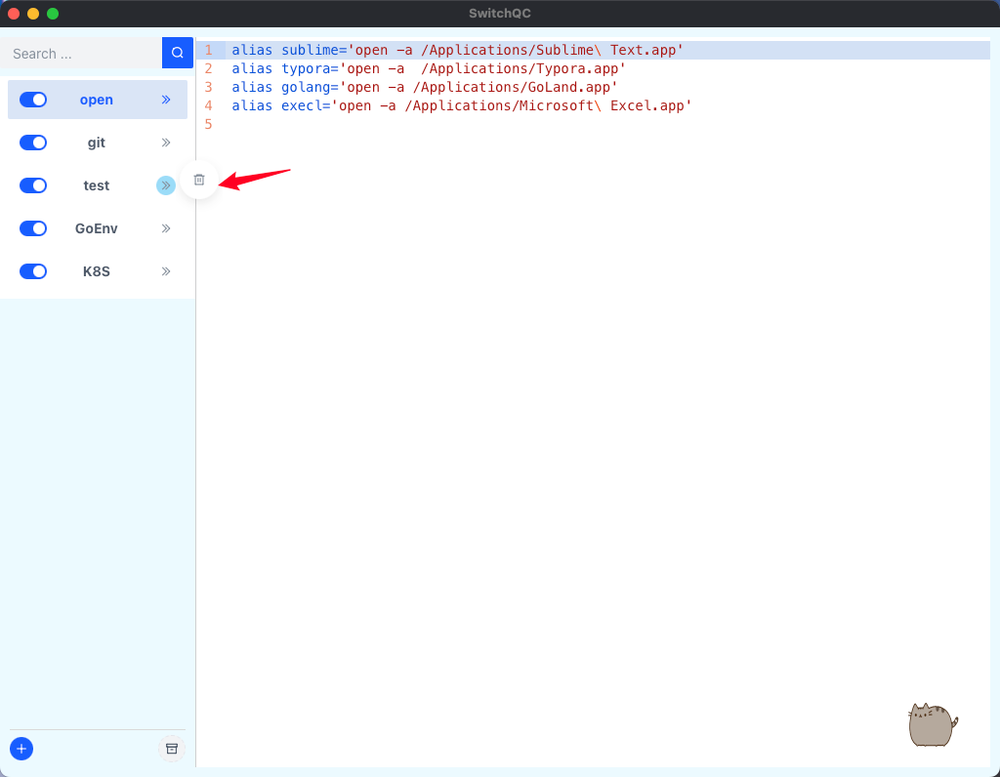
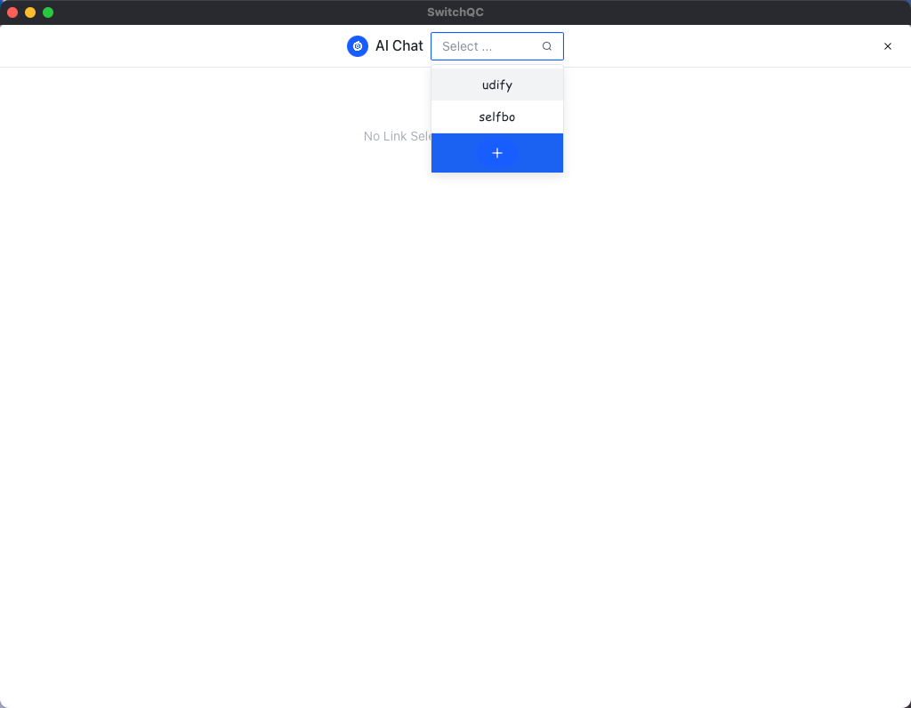

<div align="center">
  
  <h1> SwitchQC</h1>
</div>


## Introduce For SwitchQC
1. Similar to SwitchHost, SwitchQC is used to manage system variables and aliases for mac/linux;
2. Nest user-supplied AI Chat links to chat with AI;

- **Supported system**：Mac、Linux
- **Frame**：wails2
- **Frontend**： Vue3 + Arco.design
- **Backend**： Golang

## How to build

### install waild
```
go install github.com/wailsapp/wails/v2/cmd/wails@latest
```
**Reference：** https://wails.io/docs/gettingstarted/installation

### develop the program
```
wails dev
```

### build app
```
wails build -clean
```

### run app
```
# mac: After copying, double-click the app to run
cp -r build/bin/SwitchQC.app /Applications
```

## How to Use
### 1、SwitchQC Usage
**When you launch the program, the app screen is shown like this**


**Add file**


**Delete file**



**Open RecycleBin**


### 2、AI Chat Usage
**Hover the cat，click to AI chat page**


**Select which AI link to visit**




**Manage your AI link** 


### 3、How to get your AI Chat
- Come to https://cloud.dify.ai/apps?oauth_login=success to create your app，then go into app to get link


- develop your AI chat by yourself and apply to get link, you can refer it: https://github.com/Yidadaa/ChatGPT-Next-Web


## Star History

[](https://star-history.com/#chenshijian73-qq/SwitchQC&Date)
