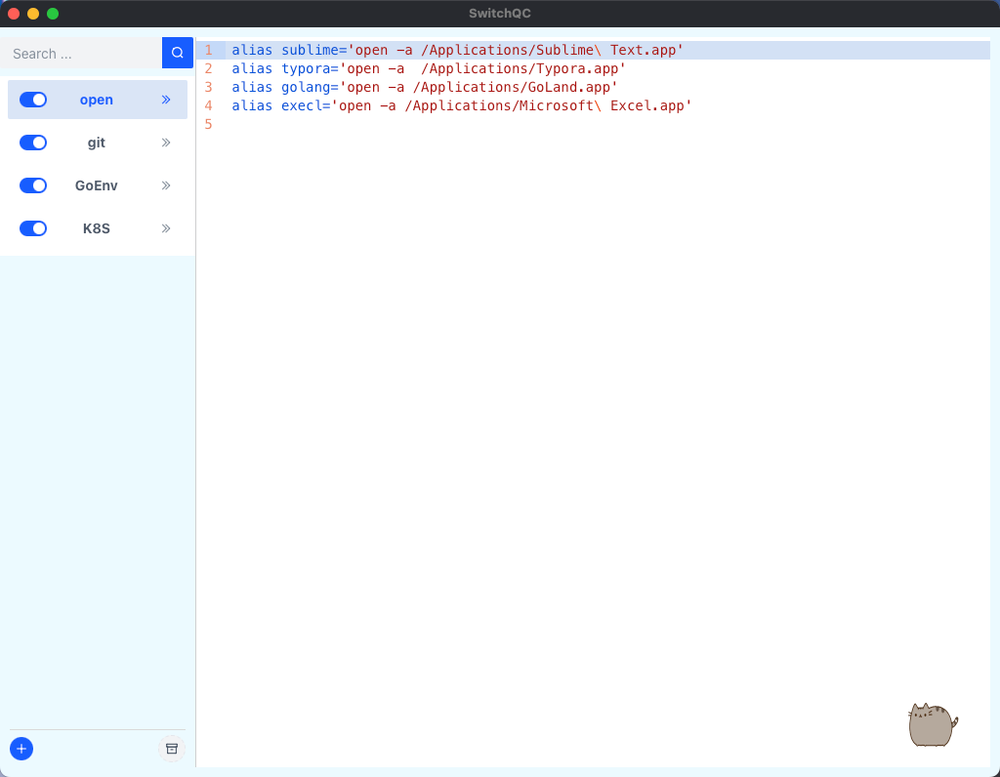
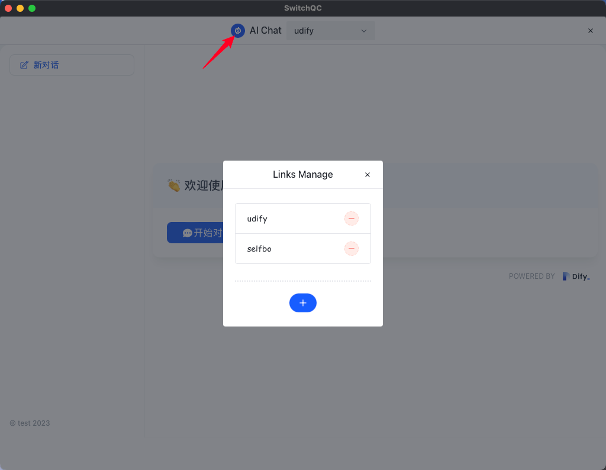
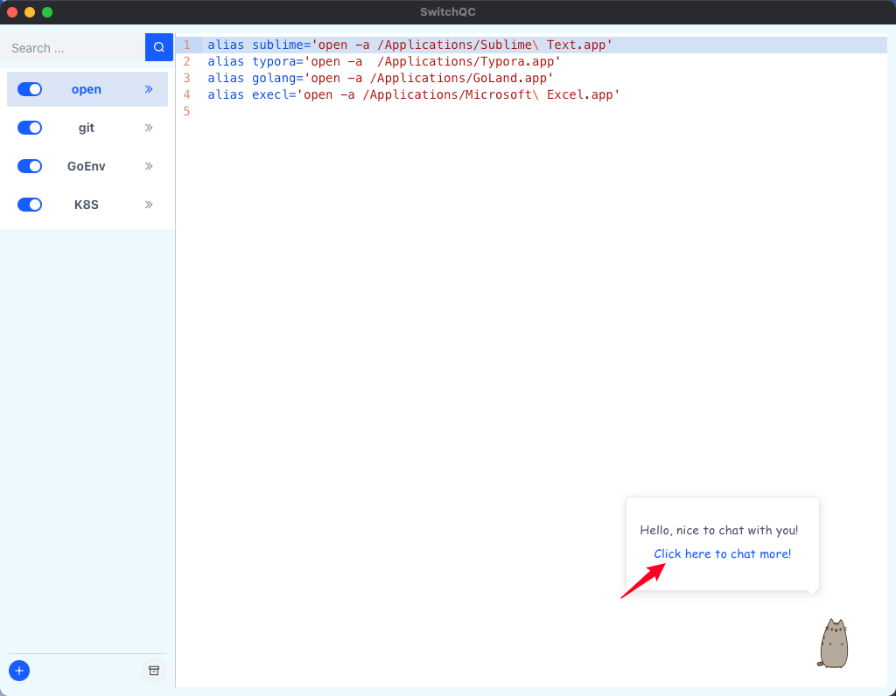

## Introduce
以文件分类的形式，将所有的别名和变量集中在一个统一的地方进行管理，更好地管理配置系统中的别名和变量，方便人员快速找到需要的配置项并进行修改，以及配置自己的快捷简洁命令

- 支持系统：Mac、Linux
- 框架：wails2
- 前端： Vue3 + Arco
- 后端： Golang

## How to build

### install waild
```
go install github.com/wailsapp/wails/v2/cmd/wails@latest
```

### develop the program
```
wails dev
```

### build app
```
wails build -clean
```

### run app
```
# mac: After copying, double-click the app to run
cp -r build/bin/QC.app ~/Applications/
```

## How to Use
When you launch the program, the app screen is shown like this:

Click any file in the navigation bar to view and edit it:

Edit it and Open new terminal to test


Delete file:

Add file:

Open RecycleBin:

Retore or Remove file in RecycleBin


