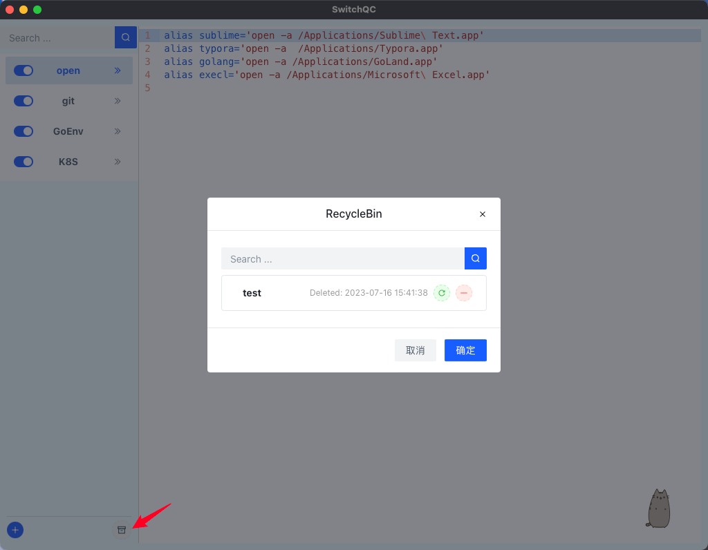

## Introduce
In the form of file classification, all aliases and variables are centralized in the desktop application for management, so that personnel can quickly find and modify the required configuration items, as well as add quick and concise commands to configure themselves.


- **Supported system**：Mac、Linux
- **Frame**：wails2
- **Frontend**： Vue3 + Arco
- **Backend**： Golang

## How to build

### install waild
```
go install github.com/wailsapp/wails/v2/cmd/wails@latest
```
**Reference：** https://wails.io/docs/gettingstarted/installation

### develop the program
```
wails dev
```

### build app
```
wails build -clean
```

### run app
```
# mac: After copying, double-click the app to run
cp -r build/bin/QC.app ~/Applications/
```

## How to Use
When you launch the program, the app screen is shown like this:

Click any file in the navigation bar to view and edit it:

Edit it and Open new terminal to test


Delete file:

Add file:

Open RecycleBin:

Retore or Remove file in RecycleBin


## Star History

[](https://star-history.com/#chenshijian73-qq/quickcmd&Date)
